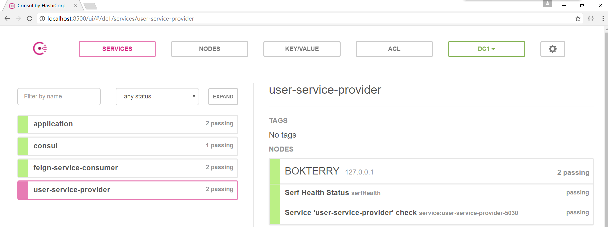

## Spring cloud Consul

### 使用[Consul](https://www.consul.io/)做服务注册发现，类似Eureka、ZooKeeper

下载Consul软件，对其运行`consul agent -dev`，启动开发模式

在项目中添加依赖
```groove
compile('org.springframework.cloud:spring-cloud-starter-consul-discovery')
```
添加consul注册中心配置
```
spring.cloud.consul.host=localhost
spring.cloud.consul.port=8500
```
打开 http://localhost:8500 查看服务注册情况



### service provider 服务提供者

在5030端口提供一组管理用户信息的接口：
```java
    @PostMapping("/user")
    User addUser(@RequestBody User user);

    @GetMapping("/getauser")
    User getUser(@RequestParam("id") Integer id);

    @GetMapping("/user")
    List<User> getAllUser();

    @DeleteMapping("/user")
    void deleteUser(@RequestParam("id") Integer id);

 ```
配置MySQL数据库
```
spring.datasource.dbcp2.driver-class-name=com.mysql.jdbc.Driver
spring.datasource.url=jdbc:mysql://127.0.0.1:3306/userdb?useUnicode=true&characterEncoding=UTF-8
spring.datasource.username=root
spring.datasource.password=qqqq
spring.jpa.hibernate.ddl-auto=update
```

### service consumer 服务消费者

在5031端口提供用户信息相关接口
```java
    @PostMapping("/user/add/{name}")
    User addUser(@PathVariable("name") String name);

    @GetMapping("/user/{id}")
    User getUser(@PathVariable("id") Integer id);

    @GetMapping("/user")
    List<User> getUserList();
```
执行post请求到http://localhost:5031/user/add/Lerry 向数据库添加一条数据

通过http://localhost:5031/user 得到用户列表
```json
[
    {
        "id": 1,
        "name": "Lerry",
        "img": "http://up.qqjia.com/z/16/tu17317_45.png",
        "sex": "girl",
        "age": 20,
        "time": 1499761984675
    },
    {
        "id": 4,
        "name": "kity",
        "img": "http://up.qqjia.com/z/16/tu17317_45.png",
        "sex": "girl",
        "age": 20,
        "time": 1499762171942
    }
]
```


